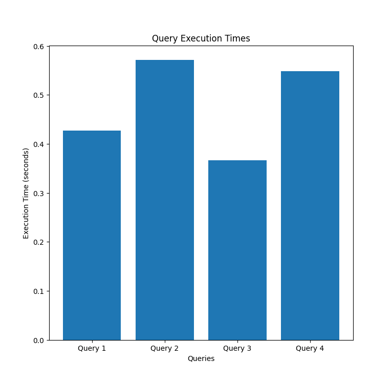
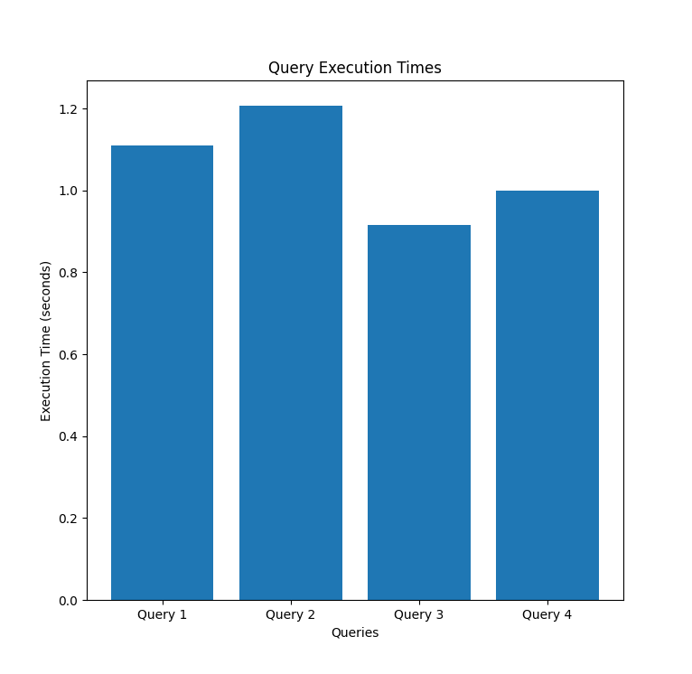
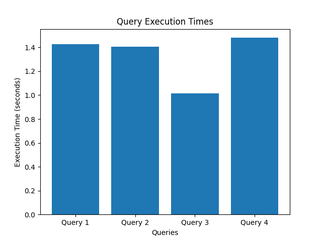
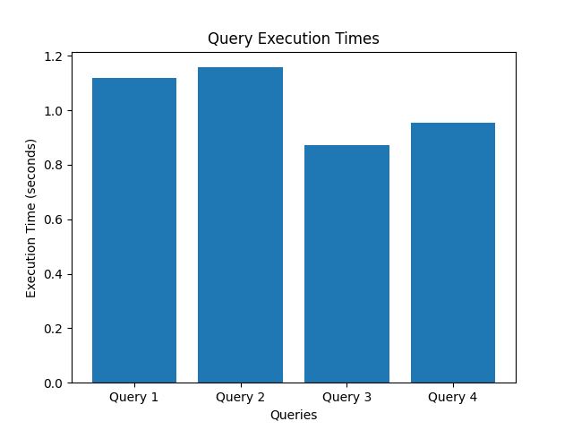

# PostgreSQL query plotter
More details here some [benchmark](https://benchmark.clickhouse.com/) 

## Visuals

Same query with different number of elements in own database.

#### Query with 400k elements and 15 elements search.

#### Query with 1 milion elements.

#### Query with 1 milion elements and 35 elements search.

#### Query with 1 milion elements and 100 elements search.``


## Files

- `insertBookingRandom.py`: This script is likely used to insert random booking data into a database or a system. It could be used for testing the functionality of a booking system by populating it with sample data to ensure that bookings are being recorded and processed correctly.
- `test.py`: This script is typically used to run a series of unit tests on your application. It might include a suite of tests that validate the correctness of your application's logic, functions, and classes to ensure that recent changes haven't broken existing functionality.

## Usage

```python
# How to run the scripts
python insertBookingRandom.py
python test.py
```
Create table in psql:
```sql
CREATE TABLE cd.bookings
(
    bookid integer NOT NULL, 
    facid integer NOT NULL, 
    memid integer NOT NULL, 
    starttime timestamp NOT NULL,
    slots integer NOT NULL,
    CONSTRAINT bookings_pk PRIMARY KEY (bookid),
    CONSTRAINT fk_bookings_facid FOREIGN KEY (facid) REFERENCES cd.facilities(facid),
    CONSTRAINT fk_bookings_memid FOREIGN KEY (memid) REFERENCES cd.members(memid)
);

```
